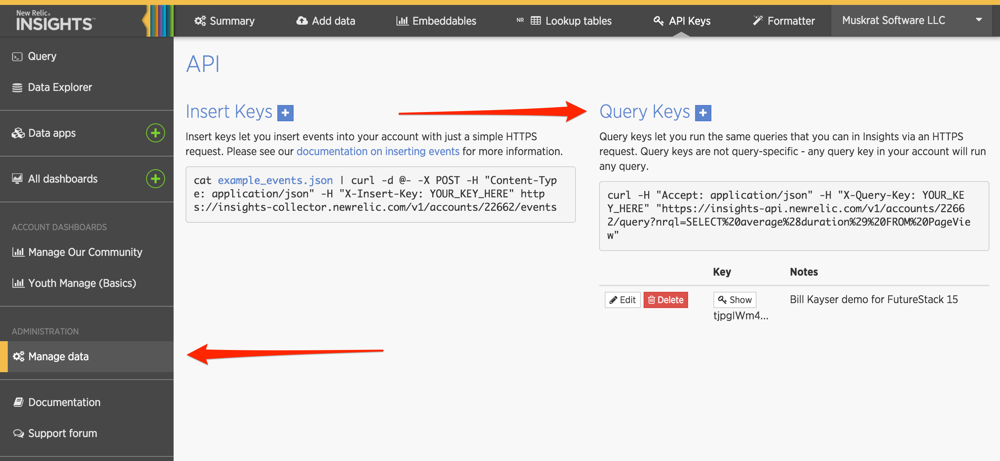
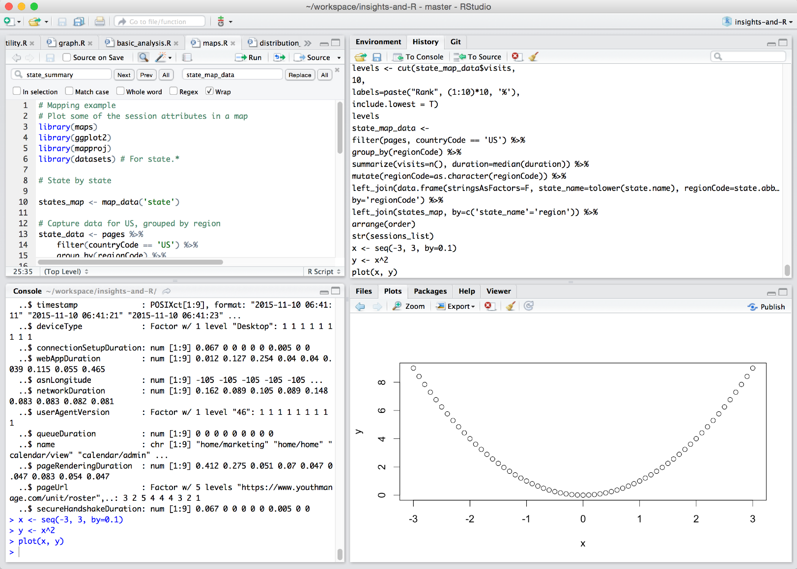
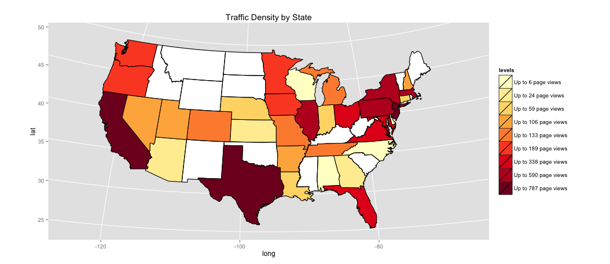

```{r setup, cache = F, echo = F, message = F, warning = F, tidy = F, autodep=F }
options(width = 70)
opts_chunk$set(message = F, error = F, warning = F, comment = NA, fig.align = 'center', dpi = 100, tidy = F, cache.path = '.cache/', fig.path = 'fig/')

options(xtable.type = 'html')
knit_hooks$set(inline = function(x) {
  if(is.numeric(x)) {
    round(x, getOption('digits'))
  } else {
    paste(as.character(x), collapse = ', ')
  }
})
knit_hooks$set(plot = knitr:::hook_plot_html)
source('accounts/justgive.R')
source('../../insights_api.R')

```

## Let's get Cooking!

Basic Ingredients:

1. Insights REST API
2. R Environment for Statistical Computing
3. R Libraries:
    * `httr`
    * `dplyr`
    * `ggplot2`
    * `igraph`

--- .class #id 

## Insights REST API

Invoke the query action with your NRQL query:

```bash
curl -H "Accept: application/json" -H "X-Query-Key: YOUR_KEY_HERE" \
"https://insights-api.newrelic.com/v1/accounts/ACCOUNT_ID/query?nrql=NRQL_QUERY"
```

<code>{"results":[{"average":0.9801766784452296}],"performanceStats":{"fileReadCount":2,"inspectedCount":903,"matchCount":283,"processCount":2,"rawBytes":205286,"decompressedBytes":205286,"fileProcessingTime":0,"mergeTime":0,"ioTime":0,"decompressionTime":0,"wallClockTime":10,"fullCacheHits":0,"partialCacheHits":0,"cacheMisses":0,"cacheSkipped":2,"maxInspectedCount":642,"minInspectedCount":261,"slowLaneFiles":0,"slowLaneFileProcessingTime":0,"slowLaneWaitTime":0,"runningQueriesTotal":2},"metadata":{"eventTypes":["PageView"],"eventType":"PageView","openEnded":true,"beginTime":"2015-11-11T15:09:34Z","endTime":"2015-11-11T16:09:34Z","beginTimeMillis":1447254574073,"endTimeMillis":1447258174073,"rawSince":"`last_hour`","rawUntil":"`now`","rawCompareWith":"","guid":"1afb-cd3c-a14d955d","routerGuid":"a61e26-6b21d6cbd","messages":[],"contents":[{"function":"average","attribute":"duration","simple":true,"openEnded":false}]}}
</code>

---

## REST API Query Keys



---

## R Statistical Computing Environment

* Download R: [r-project.org](www.r-project.org)
* Use [RStudio](www.rstudio.org)



---

## R Basics - Vectors

```{r, eval=TRUE}
c(1,2,3)
```

```{r}
1:10
```

```{r}
37
```

## R Basics - Assignment

```{r}
x <- 1
y <- "Hello"
```

---

## R Basics - Vectors

```{r}
state.abb
```
```{r}
state.abb[1]
```

```{r, eval=TRUE}
state.abb[c(1,50)]
```

---
## R Basics - Vectors

```{r}
5 * c(2,4,6)
```

```{r}
c(1,2,3) + c(4,5,6)
```

```{r}
37
```

---
## R Basics - Lists

```{r}
list(1, 'hey', NA)
```


---

## R Basics - Function calls

```{r}
x <- rnorm(10, mean=5, sd=2)
mean(x)
sd(x)
```

---
## R Basics - Data Frames

```{r}
data.frame(key=c("Eric", "Nic", "Saxon"), grade=c(3,2,1))
```
```{r}
head(mtcars)
```

---
## R Basics - Data Frames
```{r}
mtcars$mpg
```

```{r}
mtcars[5:6, c('mpg','cyl')]
```

---

## Chaining function calls

```{r,message=F}
library(dplyr)
mtcars %>% 
    select(mpg, cyl, hp) %>%
    group_by(cyl) %>%
    summarize(mean_mpg=mean(mpg), mean_hp=mean(hp)) 
```

---

## Using Httr

Invoke the Insights REST API and return the content as nested lists/vectors
```{r, tidy=TRUE, eval=FALSE}
library(httr)
call <- function(nrql_query) {
    response <- GET(paste("https://insights-api.newrelic.com/v1/accounts/",
                          account_id, "/query", sep = ''),
                    query=list(nrql=nrql_query),
                    as='text',
                    accept("application/json"),
                    add_headers('X-Query-Key'=api_key))
    return(content(response))
}

```

---

## Creating an API Helper

```{r, tidy=TRUE, eval=FALSE}
    call <- function(nrql_query) {
        message(paste("Query:", nrql_query))
        response <- GET(paste("https://insights-api.newrelic.com/v1/accounts/",
                              account_id, "/query", sep = ''),
                        query=list(nrql=nrql_query),
                        as='text',
                        accept("application/json"),
                        add_headers('X-Query-Key'=api_key))
        result <- content(response)
        if (!is.null(result$error)) {
            stop("Error in response: ", result$error)
        }
        if (!is.null(result$facets)) {
            ldply(result$facets, as.data.frame)
        } else if(names(result$results[[1]])[1] == 'events') {
            ldply(result$results[[1]]$events, as.data.frame)      
        } else {
            stop("Unsupported result type; only facets and events supported now.")
        }
    }
    
```

---

## Try it out!


```{r}
api <- insights(account_id, api_key)
api$call('select name, duration from PageView limit 5')
```

---

## Create a data frame of page views

1. Get the session ids
2. Loop over each session id and get the page views for the session
3. Do some post processing:
  * Convert the timestamps from unix time to native times
  * Remove unhelpful columns
  * Clean up the page names
  * Sort in ascending order of time

---

## Create a data frame of page views

```{r, message=F, cache=T}
session_ids <- api$get_top_session_ids(app_id, limit = 20)
sessions_list <- api$get_sessions(session_ids)
names(sessions_list[[1]])
```

---
## Page Views

Look at the first page of the first session:
```{r}

sessions_list[[1]][1,'userAgentName']
sessions_list[[1]][1,'session']
sessions_list[[1]][1,'name']
```

---
## Combine Page Views from all sessions

```{r}
pages <- rbind.fill(sessions_list)
head(sort(unique(pages$name)), 10)
```

---

## Explore the data

* Examine the dataframe
* Summarize some variables
* Tabulate page counts
* Histograms
* Barplot of mean response time by state

---

## Network Graphs

* Use [igraph](www.igraph.org)
```{r,eval=F, message=F}
install.packages('igraph')
library(igraph)
```
* Show directed graph of page flows
* Experiment with node/vertex attributes
* Show different layout algorithms

---
## Network Graphs using igraph

Pick a random session with at least 6 pages:

```{r, cache=F}
repeat {
    session <- sample(sessions_list,1)[[1]]
    if (nrow(session) > 5) break
}
session[1,'session']
session[1,'city']
```

---
## Network Graphs using iGraph

Calculate the Transitions within that session

```{r}
get_transitions <- function(session_events) {
    n <- nrow(session_events)
    if (n<2) return(data.frame())
    from <- vector('character')
    to <- vector('character')
    duration <- vector('numeric')
    for (i in 2:n) {
        from[i-1] <- as.character(session_events[i-1, 'name'])
        to[i-1] <- as.character(session_events[i, 'name'])
        duration[i-1] <- session_events[i, 'duration']
    }
    session_id <- as.character(session_events$session[1])
    return(data.frame(from=from, to=to, session=c(session_id), duration=duration))
}
```

---

## Network Graphs - Defaults

```{r, echo=F, message=F}
library(igraph)
```
```{r, fig.width=6,fig.height=4 }
edges <- get_transitions(session)
nodes <- group_by(session, name) %>% summarize(count=n(), duration=median(duration, na.rm=T))
graph <- graph.data.frame(edges, nodes, directed=T)
plot(graph)
```

---
## Network Graphs - Customized

```{r}
V(graph)$label.color <- "black"
V(graph)$label.family <- 'Helvetica'
V(graph)$label.color <- 'black'
V(graph)$label.cex <- 0.8
V(graph)$label.dist <- 0.5
V(graph)$label.degree <- pi/2
V(graph)$color <- 'lightblue'
V(graph)$size <- 20
E(graph)$color <- '#CCCCCC'
E(graph)$curved <- T
E(graph)$arrow.size <- 1
E(graph)$width <- 1.0
```

---
## Network Graphs - Customized

Plot using a different layout algorithm:
```{r, fig.height=4, fig.width=8}
plot(graph, layout=layout.kamada.kawai)
```

---
## Network Graphs - Node/Edge Attributes

```{r}

# Linear scale function
scale <- function(domain, range) {
    b <- (range[2] - range[1]) / (max(domain) - min(domain))
    a <- range[1] - b * min(domain)
    sapply(domain, function(d) { a + b * d })
}
# Set node size to scale with number of visits:
V(graph)$size <- scale(nodes$count, c(10,25))

# Set edge colors to scale with response time from gray to red
library(RColorBrewer)
pal <- colorRampPalette(c('gray', 'red'))
E(graph)$color <- pal(10)[scale(edges$duration, c(1,10))]
```

---
## Network Graphs - Node/Edge Attributes

```{r, fig.height=5, fig.width=8}
plot(graph, layout=layout.kamada.kawai)
```

---
## Network Graphs - Circle Layout

```{r, fig.height=5, fig.width=8}
plot(graph, layout=layout.circle)
```

---
## Network Graphs - Other Layouts

```{r, echo=F, message=F, fig.height=6, fig.width=9}

# Preview all the layouts
layouts <- grep("^layout\\.", ls("package:igraph"), value=TRUE) 
# Remove layouts that do not apply to our graph.
layouts <- layouts[!grepl("bipartite|merge|norm|sugiyama", layouts)]

# Set panel layout to 3 by 9
par(mfrow=c(3,3))
for (layout in layouts[1:9]) {
    l <- do.call(layout, list(graph)) 
    plot(graph, vertex.label=NA, edge.arrow.mode=0, layout=l, main=layout) 
}

```

---
## Network Graphs - Other Layouts

```{r, echo=F, message=F, fig.height=6, fig.width=9}
# Set panel layout to 3 by 9
par(mfrow=c(3,3))
for (layout in layouts[10:18]) {
    l <- do.call(layout, list(graph)) 
    plot(graph, vertex.label=NA, edge.arrow.mode=0, layout=l, main=layout) 
}

# reset the panel layout
par(mfrow=c(1,1))
```

---
## Analyze the Distribution

```{r, cache=F, echo=F, message=F}
load('accounts/rpmui.RData')
```
Create a histogram of pages betwen 0 and 20 second duration.

```{r,fig.height=4, fig.width=9, cache=F}
hist(pages$duration, breaks=seq(0,1+max(pages$duration), by=0.2), xlim=c(0,20))
```

---
## Density Plot
```{r, fig.height=5, fig.width=9, cache=F}
plot(density(pages$duration), xlim=c(0, 15))
abline(v=mean(pages$duration), lwd=2, col='orange', lty=5)
abline(v=median(pages$duration), lwd=2, col='orange', lty=1)
legend(x='topright', col='orange', lwd=2, lty=c(5,1), legend=c('Mean', 'Median'))
```

---
## Maps

Using [maps](https://cran.r-project.org/web/packages/maps/maps.pdf) project.
```{r, cache=F}
library(maps)
library(ggplot2)
library(mapproj)
```

---

## Creating Map Data

1. Filter US sessions
2. Summarize by State (`regionCode`)
3. Join with table of state names from `datasets` library: `state.abb`, `state.name`
4. Join with map data for each state
5. Re-order to drawing order of map data

```{r, cache=F}
state_summary <- filter(pages, countryCode == 'US') %>%
    group_by(regionCode) %>%
    summarize(visits=n()) %>% 
    left_join(data.frame(cbind(state_name=tolower(state.name), regionCode=state.abb)))

state_map_data <- right_join(state_summary, map_data('state'), by=c('state_name'='region')) %>%
    arrange(order)
```

---
## Using Colors

```{r,eval=F}
q_visits <- quantile(state_summary$visits, seq(0, 1, length.out=10))

levels <-  cut(state_map_data$visits,
               q_visits,
               labels=paste("Up to", round(q_visits[1:9]), "page views"),
               include.lowest = T)

pal <- brewer.pal(9, 'YlOrRd')

ggplot(state_map_data) +
    aes(x=long, y=lat, group=group, fill=levels) +
    scale_fill_manual(values=pal) +
    geom_polygon(fill='white', color='gray') +
    geom_polygon(color='black') +
    coord_map('globular') +
    ggtitle("Traffic Density by State")

```

---

## Using Colors



---

---

## Scratching the Surface...

* Statistical tools, regression analysis
* Machine Learning with [the caret package](caret.r-forge.r-project.org)
* R Web Applications with [Shiny](http://shiny.rstudio.com/)
* [Combining D3 and R with rCharts](github.com/ramnathv/rCharts)
* Reports with R Markdown and [knitr](http://yihui.name/knitr/)
* Timeseries analysis and [anomaly detection](https://github.com/twitter/AnomalyDetection).

Many, many other libraries and tools!

---
## Thanks!

# References

* Source found on [github: bkayser/insights-and-R](www.github.com/bkayser/insights-and-R)
* Network Visualization: http://kateto.net/network-visualization
* Data Science Courses from Johns Hopkins via [Coursera](https://www.coursera.org/specializations/jhudatascience)
* www.r-project.org
* www.rstudio.com

# Acknowledgements

Thank you to [JustGive.org](www.justgive.org) for allowing us to show their data.


